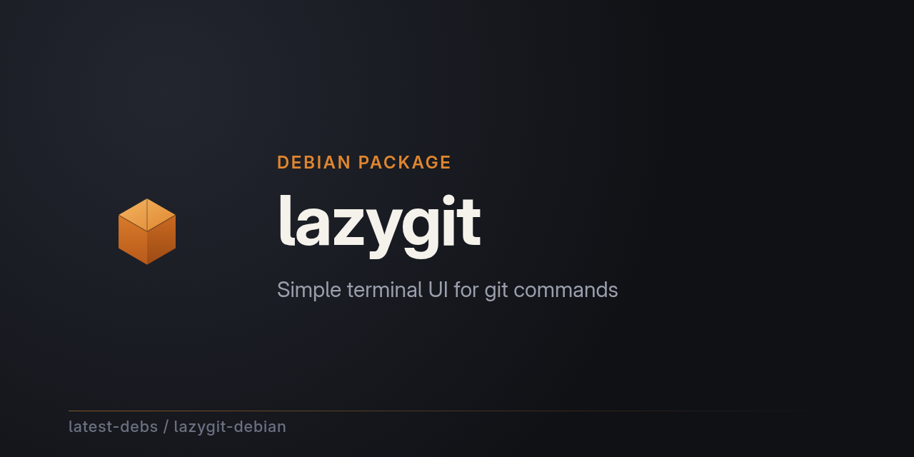

# lazygit for Debian

[lazygit](https://github.com/jesseduffield/lazygit) — a simple terminal UI for
git commands — packaged for Debian as part of
[latest-debs](https://github.com/latest-debs).

## Install

Via the latest-debs apt repository:

```sh
sudo extrepo enable latest-debs
sudo apt update
sudo apt install lazygit
```

Or download a `.deb` from the [Releases](https://github.com/latest-debs/lazygit-debian/releases) page:

```sh
sudo dpkg -i lazygit_*.deb
```

## Supported distributions & architectures

- Debian Bookworm (12), Trixie (13), Forky (14/testing), Sid (unstable)
- amd64, arm64, i386 (bookworm/trixie)

  (lazygit's upstream releases only publish amd64/arm64/32-bit Linux binaries)

## Collaborate with us

latest-debs is a community effort. If you rely on this package and want to
help keep it fresh, watching for a new upstream release or fixing a build
hiccup, we'd love your help. Open an issue on this repo, or email
**latest-debs@users.noreply.github.com** to get involved.

## Disclaimer

Unofficial packaging only. For issues with lazygit itself, see
[jesseduffield/lazygit](https://github.com/jesseduffield/lazygit).
